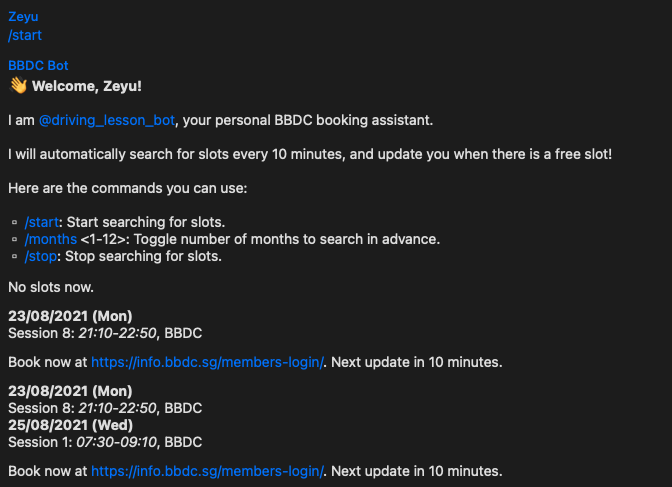

# bbdc-bot
 
Telegram bot for fetching Bukit Batok Driving Centre practical slots.

## Deployment

You need to create a Telegram bot for yourself. Refer to the Telegram API [documentation](https://core.telegram.org/bots) for more information.

Edit the [`config.ini`](config.ini) file.

### Telegram

- `api_token`: Your Telegram bot's API token
- `user_id`: Your Telegram user ID. Only this user can send or receive messages from the bot.

### BBDC

- `username`: Your BBDC username
- `password`: Your BBDC password
- `acct_id`: Your BBDC account ID. This should be shown in your BBDC profile.

## Usage

Send `/start` to start searching for slots. By default, the bot will search for slots up to 2 months in advance every 10 minutes.

Send `/months <1-12>` to toggle the number of months to search in advance.

## Common Issues

- When deploying on Heroku, dynos are stopped and restarted every 24 hours. Due to this, a SIGTERM handler is added to remind the user to send `/start` after the restart to re-queue the scheduled jobs.

- BBDC might block Heroku IP addresses. When I was using this bot, I used the [Fixie addon](https://elements.heroku.com/addons/fixie) for Heroku to route outbound requests through a different IP. Remember to set the `FIXIE_URL` environment variable within Heroku for this to work.
